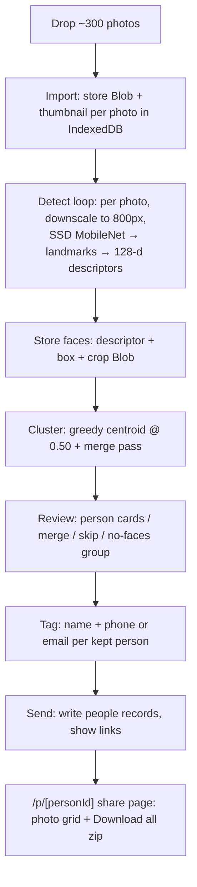

# feat: FaceSend — client-side event photo distribution app

**Target directory:** `facesend/` — a new, standalone Next.js project inside this workspace. It shares nothing with the HOMI React Native codebase; all paths below are relative to `facesend/` unless prefixed otherwise.

## Summary

Build FaceSend end to end: a single-page web app where an event organizer drops up to ~300 photos, the browser detects and clusters every face locally, the organizer tags each unique person with a name and contact, and the app generates one local share page per person containing only their photos plus a download-all button. No backend, no paid APIs — face inference runs client-side and everything persists in IndexedDB.

## Problem Frame

After an event, distributing photos means manually sorting hundreds of images by who appears in them. FaceSend automates the sort: one upload, one tagging pass, one link per person. v1 is deliberately local-first — share links resolve from the organizer's browser storage, which is acceptable for v1 and recorded as a known limitation below.

---

## Assumptions

Inferred decisions made without a synchronous user; flag any to change before or during implementation.

- The app lives at `facesend/` in this workspace as an independent npm project. It is not wired into the HOMI app, Expo, or Firebase in any way.
- "face-api.js" is honored via `@vladmandic/face-api@1.7.15` — the API-identical maintained fork. The original `justadudewhohacks/face-api.js` (last release 2020) fails under webpack 5 / modern tfjs and cannot be used.
- Share links are local-only in v1 (same browser that created them). "Send" means generating links and letting the organizer copy them; no SMS/email is actually transmitted. The spec's IndexedDB persistence requirement implies this.
- Accent color: indigo `#4F46E5`. White background, system font stack.
- Vitest covers pure logic (clustering, validation, geometry helpers). UI and the WebGL inference path are verified by running the app — jsdom cannot execute tfjs/WebGL.

---

## Requirements

**Upload & processing**

- R1. Drag-and-drop plus file-picker batch upload of up to ~300 images; non-image and unreadable files are skipped with a visible count, never a crash.
- R2. Distinct progress states for importing photos, detecting faces (per-photo counter), and clustering.
- R3. Face detection and 128-d descriptor extraction run fully client-side; no network inference calls.

**Clustering & review**

- R4. Faces are clustered across all photos into unique-person groups, tuned to avoid merging different people (split errors are recoverable, merges are not).
- R5. Photos with zero detected faces appear in a "No faces found" group rather than disappearing.
- R6. One card per person showing up to 4 sample face crops and the photo count.
- R7. The user can select two or more clusters and merge them into one person.
- R8. The user can skip a cluster; skipped clusters are excluded from send.

**Tagging & send**

- R9. Each kept cluster is tagged with a required name plus at least one of phone or email, validated before send.
- R10. "Send" produces a unique share link per tagged person (`/p/[personId]`) and a done screen listing every person with their link and a copy button.

**Share pages**

- R11. A share page shows the person's name and only the photos they appear in, as a mobile-friendly grid.
- R12. "Download all (N)" on a share page produces a zip of the full-resolution originals for that person.

**Persistence & design**

- R13. Photos, faces, clusters, and tags persist in IndexedDB; reloading the app or a share page on the same browser restores state.
- R14. Mobile-friendly layout throughout; share pages are designed phone-first.
- R15. Visual design: white background, one accent color, generous whitespace, single-page step flow, no navbar/marketing chrome.

---

## Key Technical Decisions

- **`@vladmandic/face-api@1.7.15`, pinned exactly, models vendored into `public/models/`**: the original face-api.js is unmaintained and breaks on modern bundlers; the fork is drop-in API-compatible on tfjs 4.x. The repo is archived, so pin the version and vendor the model weights so the build never depends on the repo existing. Migration path if it ever bit-rots: `@vladmandic/human`.
- **SSD MobileNet V1 + 68-point landmarks + recognition net (~12 MB total)** over TinyFaceDetector: this is batch photo processing, not live video — recall on small/rotated faces in group shots is worth the extra ~5 MB one-time download.
- **All inference inside a `'use client'` subtree, library loaded via dynamic `import()` in an effect, models loaded once through a module-level singleton.** tfjs touches `window` at module-eval time; a top-level static import crashes SSR/prerender.
- **Webpack builds with `fs: false, encoding: false` resolve fallbacks; do not use Turbopack** for dev or build — the fork has conditional Node paths, and `next.config` webpack fallbacks are ignored under Turbopack.
- **Sequential per-photo pipeline, images downscaled to ≤800 px long edge via `createImageBitmap` before inference.** tfjs serializes on one WebGL context, so parallelism buys nothing and spikes memory. Each `await` yields, keeping the progress UI live; no web worker in v1. Expected throughput: ~100–300 ms/photo desktop, up to ~1 s on phones.
- **Descriptors stored as `Float32Array` per face in IndexedDB**, so re-clustering (after merges or future threshold tuning) never re-runs inference.
- **Greedy centroid clustering at Euclidean threshold 0.50, plus a centroid-merge polish pass.** The canonical same-person threshold for this embedding is 0.6; 0.50 deliberately under-merges because the UI provides cluster merging (R7) but no cluster splitting. Threshold is a named constant.
- **IndexedDB via `idb@8`** storing Blobs directly (no base64), one photo per transaction (iOS Safari flakiness with giant transactions), small JPEG thumbnails stored per photo so grids never decode originals, `navigator.storage.persist()` requested after import.
- **`client-zip@2.5`** for download-all: streaming, constant memory, store-only — correct for already-compressed JPEGs. `showSaveFilePicker` path on Chromium, Blob-URL fallback elsewhere.
- **No state library**: the single-page flow is a small step machine (`upload → processing → review → done`) held in React state in `app/page.tsx`, with the current step mirrored to IndexedDB so reload resumes where the user left off.

---

## High-Level Technical Design



Data model (IndexedDB `facesend` database, three object stores plus a key-value meta store):

- `photos` — `{ id, name, blob, thumbBlob, width, height, faceCount }`
- `faces` — `{ id, photoId, clusterId, descriptor: Float32Array, box, cropBlob }`, indexed by `photoId` and `clusterId`
- `clusters` — `{ id, name?, contact?: {email?, phone?}, skipped: boolean, sent: boolean, sampleFaceIds }`
- `meta` — `{ step, counts, sessionCreatedAt }`

The share page derives a person's photos by `faces.clusterId → photoId → photos`, deduplicated.

---

## Output Structure

```
facesend/
├── package.json              # pins: @vladmandic/face-api 1.7.15, idb ^8, client-zip ^2.5
├── next.config.ts            # webpack fallbacks: fs/encoding false
├── vitest.config.ts
├── public/models/            # vendored: ssd_mobilenetv1, face_landmark_68, face_recognition
└── src/
    ├── app/
    │   ├── layout.tsx
    │   ├── globals.css
    │   ├── page.tsx                  # step-machine flow controller
    │   └── p/[personId]/page.tsx     # share page
    ├── components/
    │   ├── UploadStep.tsx
    │   ├── ProcessingStep.tsx
    │   ├── ReviewStep.tsx
    │   ├── PersonCard.tsx
    │   └── DoneStep.tsx
    ├── lib/
    │   ├── db.ts                     # idb schema + CRUD
    │   ├── images.ts                 # decode, downscale, thumbnail, face-crop helpers
    │   ├── contacts.ts               # name/email/phone validation
    │   ├── zip.ts                    # download-all
    │   └── face/
    │       ├── models.ts             # dynamic-import + load-once singleton
    │       ├── detect.ts             # per-photo pipeline with progress callback
    │       └── cluster.ts            # pure clustering functions
    └── types.ts
```

The tree is a scope declaration, not a constraint — per-unit `Files` lists are authoritative.

---

## Implementation Units

### U1. Scaffold, dependencies, and model assets

- **Goal:** A bootable Next.js (TypeScript, App Router, Tailwind) project with pinned dependencies, vendored face models, webpack fallbacks, base theme, and Vitest wired up.
- **Requirements:** R3, R15 (foundations)
- **Dependencies:** none
- **Files:** `package.json`, `next.config.ts`, `vitest.config.ts`, `src/app/layout.tsx`, `src/app/globals.css`, `public/models/*`
- **Approach:** `create-next-app` into `facesend/`; pin `@vladmandic/face-api` at exactly `1.7.15`; download the three model sets (manifests + shards) from the fork's `/model` directory into `public/models/`; configure webpack fallbacks and ensure dev/build scripts use webpack, not Turbopack; set the white/indigo theme tokens and a minimal layout (no nav).
- **Test scenarios:** Test expectation: none — scaffold and config.
- **Verification:** Dev server boots with no SSR errors; `GET /models/ssd_mobilenetv1_model-weights_manifest.json` returns 200; a trivial Vitest test runs.

### U2. IndexedDB data layer

- **Goal:** Typed `idb`-based persistence for photos, faces, clusters, and session meta.
- **Requirements:** R13
- **Dependencies:** U1
- **Files:** `src/lib/db.ts`, `src/types.ts`, `src/lib/__tests__/db.test.ts`
- **Approach:** One database, four stores per the data model above; `faces` indexed by `photoId` and `clusterId`. Write helpers commit one photo per transaction. Include `addPhoto`, `addFaces`, `putCluster`, `getPhotosForCluster` (dedup via the index), `getMeta`/`setMeta`, and `resetAll` (start-over). Request `navigator.storage.persist()` once after first import.
- **Patterns to follow:** `idb` openDB upgrade-versioning idiom.
- **Test scenarios** (Vitest + `fake-indexeddb`): photo put/get round-trips Blob and thumbnail intact; `getPhotosForCluster` returns each photo once when a person has two faces in one photo; `resetAll` empties every store; `getMeta` on a fresh database returns the initial `upload` step.
- **Verification:** Tests pass; data written in the app survives a hard reload.

### U3. Face detection pipeline

- **Goal:** Given a stored photo, produce faces: descriptor, bounding box, and a face-crop Blob, with progress reporting and per-photo error tolerance.
- **Requirements:** R2, R3, R5
- **Dependencies:** U1, U2
- **Files:** `src/lib/face/models.ts`, `src/lib/face/detect.ts`, `src/lib/images.ts`, `src/lib/__tests__/images.test.ts`
- **Approach:** `models.ts` holds the dynamic-import singleton — first call imports the library and `loadFromUri('/models')` for all three nets; subsequent calls are no-ops. `detect.ts` runs `detectAllFaces(input, ssdOptions).withFaceLandmarks().withFaceDescriptors()` against a canvas downscaled via `createImageBitmap`; maps boxes back to original coordinates; crops each face (box + ~25% margin, clamped to image bounds) into a JPEG Blob; disposes bitmaps. A photo whose decode or detection throws is marked `faceCount: 0` and the loop continues — one corrupt file must not kill the batch.
- **Test scenarios:** `images.ts` geometry is pure and unit-tested — downscale math preserves aspect ratio and never upscales; crop box with margin clamps at image edges (face at 0,0); box scaling from 800 px space back to a 4000 px original is exact. Inference itself: browser-verified in U8 (WebGL unavailable in jsdom).
- **Verification:** Processing a directory of real photos yields visibly correct crops and per-photo progress.

### U4. Clustering engine

- **Goal:** Pure functions that group face descriptors into person clusters and support merging.
- **Requirements:** R4, R7
- **Dependencies:** none (pure logic; integrates after U3)
- **Files:** `src/lib/face/cluster.ts`, `src/lib/__tests__/cluster.test.ts`
- **Approach:** `clusterDescriptors(faces, threshold = 0.50)`: greedy assignment to nearest centroid with incremental centroid update, then a polish pass merging clusters whose centroids sit under the threshold and reassigning borderline faces. Deterministic given input order. `mergeClusters(ids)` is a data-layer operation (re-point `faces.clusterId`, recompute samples). Distances via a hand-rolled Euclidean loop — no library.
- **Test scenarios:** identical descriptors land in one cluster; two synthetic descriptor groups separated well beyond 0.50 form exactly two clusters; a third group placed between two near-identical clusters triggers the polish-pass merge; empty input returns no clusters; single face returns one cluster; output is stable across two runs on the same input.
- **Verification:** Tests pass; on a real photo set, one cluster per attendee with no cross-person merges at 0.50.

### U5. Upload and processing screens

- **Goal:** Step 1–2 of the flow: drag-and-drop import with validation, then the detection + clustering run with live progress.
- **Requirements:** R1, R2, R5
- **Dependencies:** U2, U3, U4
- **Files:** `src/app/page.tsx`, `src/components/UploadStep.tsx`, `src/components/ProcessingStep.tsx`
- **Approach:** `page.tsx` owns the step machine and resumes from `meta.step` on mount. UploadStep: full-screen dropzone plus hidden file input; filter to image MIME types; cap at 300 with a "first 300 kept" notice; generate thumbnails during import with an "Importing X/Y" state. ProcessingStep drives the sequential detect loop ("Detecting faces 34/120"), then clustering (near-instant, still shown as a state), writes clusters, advances to review.
- **Test scenarios:** browser-verified — dropping a `.txt` among images skips it with a count; dropping 0 images keeps the dropzone with guidance; a batch where no photo has any face still advances to review showing only the no-faces group; mid-processing reload resumes at upload of remaining work or restarts processing cleanly (pick and document one — restarting detection for unprocessed photos is acceptable since descriptors of processed photos persist).
- **Verification:** 100-photo batch imports and processes with continuously updating progress and a responsive tab.

### U6. Review, merge, skip, and tagging UI

- **Goal:** Step 3–4: person cards with sample crops, merge and skip controls, and per-person name/contact tagging with validation.
- **Requirements:** R5, R6, R7, R8, R9
- **Dependencies:** U5
- **Files:** `src/components/ReviewStep.tsx`, `src/components/PersonCard.tsx`, `src/lib/contacts.ts`, `src/lib/__tests__/contacts.test.ts`
- **Approach:** Card grid sorted by photo count; each card shows up to 4 crops, count, name input, one contact input (email or phone, auto-detected), and a skip toggle (card dims, excluded from send). Merge mode: "Merge people" toggles selection checkboxes; confirming calls `mergeClusters` and re-renders. "No faces found (N)" renders as a distinct collapsed section of photo thumbnails. The Send button stays disabled until every non-skipped cluster passes validation, with inline errors on offenders.
- **Test scenarios:** `contacts.ts` unit tests — valid email accepted; `not-an-email` rejected; 10/11-digit phone with spaces/dashes/parens normalizes and validates; 3-digit string rejected; empty name rejected; name plus either contact type passes. UI browser scenarios: merging two clusters of the same person produces one card with combined count; a skipped cluster never appears on the done screen; Send disabled state lifts exactly when the last untagged card is filled.
- **Verification:** A deliberately split person can be merged in two clicks; validation blocks send until tags are complete.

### U7. Send, done screen, and share pages

- **Goal:** Step 5: generate per-person links, the done screen, and the share page with download-all.
- **Requirements:** R10, R11, R12, R13, R14
- **Dependencies:** U6
- **Files:** `src/components/DoneStep.tsx`, `src/app/p/[personId]/page.tsx`, `src/lib/zip.ts`
- **Approach:** Send marks clusters `sent`, advances to done. DoneStep lists each person with `/p/{clusterId}` and a copy-link button (`navigator.clipboard` with fallback), plus a clearly-worded note that links open on this browser, and a "Start over" action calling `resetAll`. Share page is a `'use client'` component reading IndexedDB by `personId`: name header, responsive thumbnail grid (lazy object URLs, revoked on unmount), tap-to-view full image, "Download all (N)" streaming originals through `client-zip` named `{person}-photos.zip` — `showSaveFilePicker` when available, Blob URL otherwise. Unknown ID or empty storage renders a friendly "link not available on this device" state, not a crash.
- **Test scenarios:** `zip.ts` filename sanitation unit-tested (person named `Ana / O'Brien?` yields a safe filename; duplicate photo names deduplicated inside the archive). Browser scenarios: share page shows only that person's photos including multi-person photos shared across pages; a photo containing two tagged people appears on both pages; opening a share link in the same browser after reload works (R13); opening an unknown `personId` shows the friendly empty state; downloaded zip contains exactly N original files.
- **Verification:** Two-person photo set end-to-end: each link shows the right subset and the zip round-trips.

### U8. End-to-end verification and hardening

- **Goal:** The app builds and the full flow works against real photos; rough edges fixed.
- **Requirements:** all
- **Dependencies:** U1–U7
- **Files:** touch-ups across the tree as discovered
- **Approach:** Production build must pass (webpack); run the complete flow with a real multi-person photo batch; verify mobile layout at 375 px width for every step and especially share pages; confirm no network calls during inference (DevTools); surface `navigator.storage.estimate()` somewhere unobtrusive if quota pressure appears; fix all console errors.
- **Test scenarios:** Test expectation: none — this unit executes the browser scenarios enumerated in U5–U7 and fixes fallout.
- **Verification:** `next build` clean; full upload→send→share→download flow succeeds on a fresh profile; share grid is comfortably usable at phone width.

---

## Scope Boundaries

**Deferred to follow-up work**

- Actually transmitting links by SMS/email (requires a backend or third-party sender).
- Server-hosted share pages that work on recipients' devices — the natural v2; the per-person data derivation in U7 is the seam to lift.
- Web-worker inference, HEIC conversion beyond native browser decode, a user-facing cluster-threshold slider, splitting a cluster (merge-only in v1, mitigated by the 0.50 threshold), multi-event management.

**Outside this product's identity**

- Paid face-recognition APIs, cloud photo storage, accounts/auth.

---

## Risks & Dependencies

- **Archived upstream:** `@vladmandic/face-api` will never ship another release. Mitigated by exact pin + vendored models; escape hatch is `@vladmandic/human`.
- **Safari storage eviction:** WebKit purges origin storage after 7 days without interaction; `persist()` is requested but not guaranteed. Share pages on Safari are best treated as short-lived; the done screen wording should not promise permanence.
- **Mobile processing time:** ~300 photos can take 3–6 minutes on a mid-range phone. Acceptable for v1 (organizers will mostly run this on laptops); the progress UI is the mitigation.
- **Turbopack drift:** Next.js increasingly defaults to Turbopack; scripts must explicitly select webpack or carry equivalent `resolveAlias` config, or the `fs` fallback silently disappears.

---

## Sources & Research

- `@vladmandic/face-api` repo (archived 2025-02, final 1.7.15; model files under `/model`) and its issue #42 (`fs` resolution) — basis for the pin + fallback KTDs.
- face-api.js docs: model sizes, `FaceMatcher` default 0.6 distance; Nextcloud facerecognition wiki on clustering-threshold trade-offs — basis for the 0.50 choice.
- MDN storage quota/eviction docs and WebKit storage-policy posts — basis for the `persist()` + Safari caveat.
- `client-zip` README and benchmarks vs JSZip/fflate — basis for the streaming-zip KTD.
