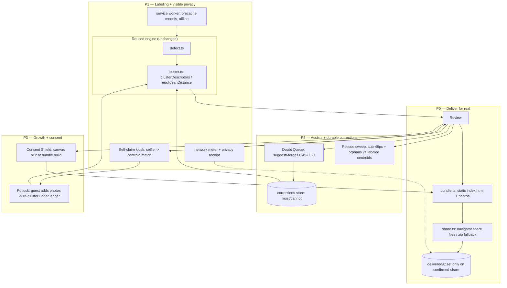

<!-- Product Contract preservation: unchanged. ce-plan added the Planning Contract, Implementation Units, Verification Contract, and Definition of Done below; the Product Contract (Summary through Sources) is the brainstorm's WHAT and was not rewritten. -->

# FaceSend On-Device Revamp - Plan

## Goal Capsule

- **Objective:** Turn FaceSend from a face-sorter that can't really deliver into a product a one-off event host actually finishes and shares — without adding any server. Fix delivery, cut labeling friction, and make the on-device privacy story the visible selling point.
- **Product authority:** The repo owner (host persona). All product decisions in this doc are resolved; no external stakeholder sign-off pending.
- **Open blockers:** None. Every material product decision was resolved at intake (see Key Decisions). Remaining forks are engineering-level and deferred to planning.

## Product Contract

### Summary

Rebuild FaceSend's delivery and labeling around a strict no-server constraint. Each person's photos become a **self-contained portable gallery** the host sends through the OS share sheet (replacing the dead device-local link page). A **pass-the-phone self-claim kiosk** lets guests find themselves by selfie and type their own name, so the host only labels stragglers. A **service-worker privacy layer** makes "works with your Wi-Fi off" a demonstrable feature. Recognition assists (Doubt Queue, rescue sweep), a corrections ledger that survives re-clustering, a guest photo-contribution loop, and per-recipient bystander blur extend the product as far as is possible entirely on-device.

### Problem Frame

FaceSend markets itself as automatic photo *distribution*, but the only working "send" is the host manually pushing each person's photos through the share sheet one recipient at a time — the host must know and pick every recipient. The `/p/[personId]` link page that would make photos openable elsewhere is dead code: never linked, and structurally device-local (its own error tells recipients to "open this link on the device that created it"). The contact-collection layer is dead too — validated, tested, wired to nothing.

Meanwhile effort has gone into clustering accuracy (6 of the last 10 commits), which is already past diminishing returns, while the two things that actually gate adoption — getting photos onto other people's devices, and not having to type everyone's name — went unaddressed. Every competitor (Waldo, Premagic, Kwikpic, Pic-Time, Memzo, Fotify) solves delivery with a server. FaceSend's genuine white-space is that none of them process on-device; that property is invisible in the current UI.

### Key Decisions

- **No backend, ever, in this scope.** Stay 100% on-device. This rules out cloud links that open anywhere, zero-knowledge hosted blobs, and automated SMS/email sending. Those are out of scope, not deferred-soon. Every requirement below is reachable in the browser alone.
- **Target the one-off event host first.** Wedding/party/reunion/trip camera roll, get everyone their photos once, be done. No accounts, no login, no cross-event people directory (that was a repeat-organizer feature and is explicitly not this user).
- **Delivery is a portable gallery bundle, not a link.** The deliverable is an artifact the recipient owns outright: their photos plus an embedded offline `index.html` gallery, handed to the OS share sheet (AirDrop / WhatsApp / Mail / save-to-camera-roll), with a zip download fallback where the share sheet can't take files.
- **Labeling inverts to self-claim where it can.** A pass-the-phone kiosk lets a co-located guest match themselves by selfie and enter their own contact; the host types only for people who never reach the kiosk. Not chosen: roster/CSV import, phone contact-picker autofill.
- **Privacy is a feature, not a footnote.** The on-device property becomes verifiable in the UI (offline-capable, network meter, end-of-event receipt) so a non-technical host can perceive the one thing competitors can't copy.
- **Keep the engine, replace the chassis.** `src/lib/face/*`, `images.ts`, `zip.ts`, `id.ts`, and the transactional `db.ts` patterns are sound and stay. The React/flow layer, the dead link route, and the storage-is-delivery assumption are what change.

### Actors

- A1. **Host** — owns the device and the photos; runs upload → process → review → deliver; labels stragglers; controls kiosk and consent settings.
- A2. **Guest (self-claim)** — a co-located person at the kiosk who takes a selfie, is matched to their cluster, and enters their own name/contact; optionally contributes their own event photos.
- A3. **Recipient** — anyone who receives a portable gallery bundle on their own device and opens it offline. (Often the same human as A2, at a later moment and a different device.)

### Key Flows

- F1. **Deliver (host).** After review, host picks a person → app assembles that person's bundle (photos + generated `index.html`) → `navigator.share()` with files, or zip download fallback → host confirms the OS send. Delivery state reflects only a confirmed hand-off, never an unconfirmed fallback.
- F2. **Self-claim (kiosk).** Host enters kiosk mode and hands the device over → guest taps "Find me" → selfie via `getUserMedia` → descriptor computed locally, matched to the nearest cluster centroid → on a confident match, guest sees "Is this you?" with sample photos → guest types their own name/contact → returns to host. Ambiguous/no match routes the guest to a short pick-from-faces fallback or a "hand back to host" exit.
- F3. **Rescue + doubt review (host).** After first-pass clustering, the host is shown only uncertain merges (centroid distance in the 0.4–0.6 band) as one-tap "Same person?" cards, and after any person is named, a rescue sweep offers previously-orphaned or sub-48px faces that now match a labeled centroid ("found 12 more of Priya — accept/reject").
- F4. **Contribute back (kiosk, P3).** After claiming, a guest may add their own event photos from their device → photos are face-processed and re-clustered under existing corrections → any person appearing in them gains photos and is re-flagged for delivery.

### Requirements

**Delivery (P0)**

- R1. Each non-skipped person can be delivered as a single self-contained bundle: their full-resolution photos plus a generated `index.html` gallery (named header, responsive grid, tap-to-open lightbox) that renders offline on any device with no FaceSend install. *Accepts when:* opening the bundle's `index.html` on a second device with no network shows exactly that person's photos in a working gallery.
- R2. Delivery uses the Web Share API with files when available and falls back to a downloadable `.zip` otherwise; the fallback is explained, not silent. *Accepts when:* on a share-capable device the OS sheet opens with the files; on desktop Chrome a named zip downloads and the UI states a zip was produced.
- R3. The dead `/p/[personId]` route and its device-local link model are removed (or repurposed only as the in-bundle gallery template). No UI offers a link that cannot open off-device. *Accepts when:* no code path generates or renders a device-local share URL; grep for the old route returns only the bundle template, if anything.
- R4. A person's delivery status reflects a confirmed hand-off only. A cancelled share, or a zip that downloaded but was never sent, does not read as "shared." *Accepts when:* cancelling the OS share sheet leaves the person marked not-yet-delivered; a completed share marks delivered.

**Labeling & self-claim (P1)**

- R5. The host can enter a locked kiosk mode safe to hand to a guest: it exposes only the self-claim flow and cannot navigate to host controls, delete data, or expose other guests' contacts. *Accepts when:* from kiosk mode there is no reachable control that mutates the event or reveals another person's contact.
- R6. In kiosk mode a guest captures a selfie via the camera, has a descriptor computed on-device, and is matched to the nearest cluster centroid; a confident match shows sample photos and a confirm step before any write. *Accepts when:* a guest whose face is in the set is shown their own cluster and no photos leave the device (network meter stays flat).
- R7. A matched guest enters their own name and optional contact, written to that cluster; an ambiguous or failed match offers a bounded fallback (pick from a few candidate faces, or hand back to host) rather than a dead end or a wrong-cluster write. *Accepts when:* a no-match selfie never silently attaches the guest to a random cluster.
- R8. Manual labeling of stragglers is polished: inline name entry with immediate persistence, clear per-person "labeled / unlabeled / skipped / delivered" state, and no full re-render churn on each edit. *Accepts when:* naming a card persists on blur and updates only that card.

**Privacy & trust (P1)**

- R9. A service worker pre-caches the app shell and the ~12 MB of face models so the full flow — upload, detect, cluster, deliver — runs with the network off after first load. *Accepts when:* with airplane mode on (post-install), a fresh event can be processed and a bundle produced end-to-end.
- R10. The UI surfaces a live network meter that itemizes every outbound request; during processing it shows zero network activity (model weights already cached). *Accepts when:* processing 100 photos offline shows an empty/zeroed request list.
- R11. The host can end an event with a privacy receipt (N photos, M faces, processed on this device, zero bytes uploaded) and optionally set a retention sunset that auto-purges face data after a chosen window. *Accepts when:* the receipt reflects real session counts and the sunset actually deletes descriptors/crops on/after its date.

**Recognition assists (P2)**

- R12. After clustering, the host reviews only genuinely uncertain pairs — clusters whose centroid distance is in the 0.4–0.6 band — as one-tap "Same person?" cards; confident groupings are never surfaced for review. *Accepts when:* pairs below 0.4 auto-merge and pairs above 0.6 never appear as suggestions.
- R13. A rescue sweep matches previously-orphaned singletons and faces dropped for being under 48 px against now-labeled centroids and offers them as accept/reject additions to that person. *Accepts when:* a labeled person can gain a correctly-matched photo that first-pass detection had dropped.

**Corrections durability (P2)**

- R14. Every host correction — a merge, a smart-eject, a Doubt Queue answer — persists as a must-link / cannot-link constraint stored beside the descriptors, and any subsequent re-clustering enforces it. *Accepts when:* re-clustering after adding photos never resurrects a merge the host already rejected or splits a merge the host confirmed.

**Growth loop (P3, highest risk)**

- R15. After claiming, a guest at the kiosk can contribute their own event photos; contributed photos are face-processed, re-clustered under existing corrections (R14), and anyone appearing in them is re-flagged for delivery. *Accepts when:* a guest-contributed group photo makes its subjects' bundles regenerate to include it, with prior corrections intact.

**Consent (P3)**

- R16. The host can mark a person "do not distribute"; that person's face is blurred via an on-device canvas pass in every *other* recipient's copy, so each recipient receives a consent-respecting version of shared group photos. *Accepts when:* a bundle for person B never shows person A's unblurred face once A is marked do-not-distribute.

**Reliability (cross-cutting, P0)**

- R17. Every host-facing action that can fail — detection of a photo, a share, a bundle build, a purge — shows a visible success or a visible, distinct error, and never falls through silently to a default. *Accepts when:* a photo that fails detection is reported as failed (not silently filed under "No faces found"); a failed share surfaces an error rather than a silent zip fallback presented as success.

### Acceptance Examples

- AE1. **Covers R1, R2.** A host at a 30-person reunion, offline, taps deliver on "Ana." The OS share sheet opens with Ana's 18 photos and a gallery file. Ana AirDrops it to herself, opens `index.html` on her phone with no signal, and scrolls all 18 in a lightbox.
- AE2. **Covers R4, R17.** The host taps deliver, then cancels the share sheet. The person's card still reads "not delivered." A second attempt where the OS reports failure shows "Couldn't share — try again," not a green check.
- AE3. **Covers R6, R7.** A guest at the kiosk takes a selfie in dim light; no cluster matches confidently. Instead of attaching them to the nearest stranger, the app shows four candidate faces to pick from, or a "hand back to host" button.
- AE4. **Covers R9, R10.** With Wi-Fi and cellular off after first install, the host imports 80 photos, watches detection run, sees the network meter stay at zero, and produces bundles — proving the privacy claim in five seconds.
- AE5. **Covers R14, R15.** The host rejected a bad A=B merge earlier. A guest later contributes 12 photos and re-clustering runs; A and B stay separate, and the new photos flow only to the people actually in them.

### Success Criteria

- A first-time host completes upload → deliver-to-at-least-one-recipient without hitting a dead link or a manual per-name typing wall.
- The privacy property is perceivable by a non-technical host (they can watch it work offline), not just asserted in the README.
- No user-facing action fails silently (R17 holds across the flow).
- The existing tested `lib/` engine is reused, not rewritten; new logic is additive.

### Scope Boundaries

**Deferred for later**
- Any server-dependent delivery: anywhere-openable links, zero-knowledge hosted blobs, programmatic SMS/email sending.
- Cross-event people directory / repeat-host recognition and the accounts it implies.
- Roster/CSV import and phone contact-picker autofill.
- Web-worker processing, HEIC conversion beyond native decode (revisit if they block the P0/P1 experience).

**Outside this product's identity**
- Paid face-recognition APIs, cloud photo storage, mandatory accounts/auth.

### Dependencies / Assumptions

- Assumes `@vladmandic/face-api` stays pinned and models stay vendored (upstream is archived); service-worker caching (R9) depends on those assets being local, which they already are.
- Assumes the self-claim value holds mainly for co-located gatherings; for large or dispersed events the host falls back to manual labeling + bundle delivery. This is an accepted boundary, not a gap.
- Assumes `getUserMedia` and the Web Share API with files are available on the host's primary device; degraded fallbacks (zip download; host-typed labels) cover devices where they aren't.
- Assumes `navigator.storage.persist()` best-effort persistence; Safari 7-day eviction means bundles are the durable artifact, not IndexedDB.

### Outstanding Questions

**Resolve Before Planning**
- None. All product decisions resolved at intake.

**Deferred to Planning**
- Confident-match distance threshold for self-claim (R6) and the ambiguity band that triggers the pick-from-faces fallback (R7).
- Constraint-conflict resolution rule when a must-link and a cannot-link collide during re-clustering (R14).
- Whether the in-bundle gallery reuses the existing `/p/[personId]` component as a static template or is authored fresh (R3).
- Consent Shield throughput: per-recipient re-encode cost and whether it stays synchronous (R16).
- Service-worker update/versioning strategy to avoid stale-app traps (R9).

### Sources / Research

- `docs/ideation/2026-06-10-facesend-feature-ideas-ideation.html` — the 10 ranked ideas this scope draws from: Portable Gallery Bundles (6), Self-Claim (3), Airplane-Mode Proof (10), Doubt Queue (1), Corrections Ledger (2), Photo Potluck (8), Consent Shield (9); plus the competitor scan establishing on-device as white-space.
- `docs/plans/2026-06-09-002-feat-facesend-photo-distribution-plan.md` — the original build: architecture, KTDs (0.4 threshold, chip-pass descriptors, iOS transaction quirks), and the v1 local-only-links limitation this revamp targets.
- Current code — `src/lib/face/*` (clustering, `euclideanDistance`, `suggestMerges` defined-but-unwired), `src/lib/db.ts` (`replaceClusters` discards manual state — the R14 driver), `src/app/p/[personId]/page.tsx` (dead route), `src/lib/contacts.ts` (dead validation layer), `src/lib/share.ts` (current share-sheet delivery to extend).

---

## Planning Contract

*Enriches the Product Contract above with HOW. Product scope is unchanged; engineering forks from "Deferred to Planning" are resolved here as Key Technical Decisions.*

### Key Technical Decisions

- **KTD1 — The bundle is framework-free static HTML, authored fresh; the dead route is deleted.** `src/app/p/[personId]/page.tsx` is a Next.js client component bound to IndexedDB and the Next runtime — it cannot travel. A new pure generator `src/lib/bundle.ts` emits a self-contained `index.html` string with inlined CSS + a few lines of vanilla JS (grid, lightbox) that references photos by relative filename inside the zip. Resolves the R3 fork: reuse nothing from the route; delete it. *(Deferred-to-Planning: in-bundle gallery source.)*
- **KTD2 — Delivery state is a confirmed-only `deliveredAt` timestamp, replacing the optimistic boolean `sent`.** `navigator.share()` resolving is the only signal that marks delivery; a thrown/aborted share or a zip that merely downloaded leaves `deliveredAt` null and surfaces the real outcome. Kills the "false shared ✓" bug (R4, R17). idb v2 migration adds `deliveredAt: number | null` and **resets it to null for all existing clusters** — the old `sent` flag was optimistic (a downloaded-but-never-sent zip read as sent), so it is not trustworthy to carry forward; hosts re-confirm delivery under the honest model.
- **KTD2b — Bundles offer a size-aware export.** A person in many full-res photos can exceed channel limits (WhatsApp ~100 MB, email ~25 MB, AirDrop effectively unbounded). `buildBundle` takes a size mode — `original` (default) or `phone-sized` (long-edge downscale via `images.ts`) — and the deliver UI estimates bundle size and warns when it likely exceeds the chosen channel, offering phone-sized instead of failing mid-share.
- **KTD3 — Self-claim matches against cluster centroids with a margin gate.** Compute the selfie descriptor on-device, take Euclidean distance to every centroid. Confident match = nearest `< 0.45` **and** (second-nearest − nearest) `> 0.05` (the margin gate stops a confident-but-ambiguous mis-attach). Band `0.45–0.60` or a failed margin → show up to 4 nearest candidates to pick from. `≥ 0.60` → "not found," offer hand-back-to-host / manual. Resolves the R6/R7 fork. *(Deferred-to-Planning: self-claim thresholds.)*
- **KTD4 — Corrections are must-link / cannot-link constraints; newest correction wins on conflict.** A new `corrections` store holds `{ id, kind: 'must' | 'cannot', faceA, faceB, createdAt }`. Constrained clustering applies must-links by union-find pre-merge and enforces cannot-links as hard blocks during assignment (COP-KMEANS-style). On a direct conflict (a new cannot-link between two faces an older must-link joined, or vice-versa), the newer `createdAt` wins and the older constraint is dropped with a surfaced notice. Resolves the R14 fork. *(Deferred-to-Planning: constraint-conflict rule.)*
- **KTD5 — Sub-48px faces are retained-but-flagged, not discarded.** `src/lib/face/detect.ts` currently drops faces under `MIN_FACE_PX`. Change it to persist them with `belowThreshold: true` and exclude them from first-pass clustering; the rescue sweep (R13) reconsiders them against labeled centroids. Without this, R13's "found more photos" has nothing to find.
- **KTD6 — Offline via a hand-rolled service worker: explicit model precache + runtime app-shell caching, versioned, with an update prompt.** Precache the known-path `/models/*` weights (the ~12 MB, stable filenames) on `install`; cache the Next app shell + chunks via stale-while-revalidate runtime caching (Next chunk hashes aren't enumerable at build time, so runtime caching is the robust choice). Cache name carries a build version; `activate` purges old caches; `skipWaiting`/`clients.claim` gated behind a visible "Update ready — reload" prompt to avoid stale-app traps. No `next-pwa`/`serwist` dependency — a ~60-line `public/sw.js` keeps the zero-heavy-deps posture. Resolves the R9 fork. *(Deferred-to-Planning: SW update strategy.)*
- **KTD7 — Consent Shield is opt-in, lazy, and cached at bundle-build time.** Only when a person is flagged do-not-distribute, and only for photos that both contain that face and are bound for someone else, does the canvas blur pass run (draw image → pixelate each flagged face box via downscale/upscale → re-encode JPEG). Blurred variants are memoized by `(photoId, sorted flaggedFaceIds)` so a photo shared to N recipients re-encodes once. Stays synchronous with visible progress; if throughput fails the P3 spike, it degrades to "exclude the whole photo" rather than blocking delivery. Resolves the R16 fork. *(Deferred-to-Planning: Consent Shield throughput.)*
- **KTD8 — Keep the engine; all new logic is additive.** `clusterDescriptors`, `euclideanDistance`, `smartEjectSet`, `suggestMerges`, the `images.ts`/`zip.ts` helpers, and `db.ts` transactional idioms are reused as-is. `suggestMerges` (already defined, tested, unwired) is finally consumed by the Doubt Queue (R12). `contacts.ts` (dead validation) is revived by polished manual labeling and self-claim (R7, R8) rather than deleted.

### High-Level Technical Design

Data-model changes (idb `facesend`, staged version bumps — land each migration before the code reading it):

- **v2 (P0):** `ClusterRecord.sent: boolean` → `deliveredAt: number | null`; add `deliveryError?: string`. Revive `ClusterRecord.contact` reads.
- **v3 (P1):** `FaceRecord.belowThreshold?: boolean` (KTD5, populated going forward; back-compat: absent = false).
- **v4 (P2):** new `corrections` store `{ id, kind, faceA, faceB, createdAt }`, indexed by face.
- **v5 (P3):** `ClusterRecord.doNotDistribute?: boolean`; `photos` gain no new store — blurred variants are ephemeral, built at delivery.

### Implementation Units

Grouped by phase. Each phase is independently shippable; P0 alone already fixes the core "can't deliver / lies about delivering" failure.

#### Phase P0 — Deliver for real, stop lying about it

##### U1. Portable gallery bundle generator

- **Goal:** A pure function that turns one person's photos into a self-contained, offline-openable gallery artifact.
- **Requirements:** R1, R3
- **Dependencies:** none
- **Files:** `src/lib/bundle.ts`, `src/lib/__tests__/bundle.test.ts`
- **Approach:** `buildBundle(person, photos, { size })` returns `{ files: {name, blob}[], estBytes }` where one file is `index.html` (inlined CSS + vanilla-JS grid/lightbox, named header, references `photos/<sanitized>.jpg` by relative path) and the rest are the photos at the requested `size` (`original` default, or `phone-sized` downscaled via `images.ts`). Reuse `zip.ts` filename sanitation and dedup. No React, no Next, no external URLs — opens from `file://` offline (KTD1, KTD2b).
- **Patterns to follow:** `src/lib/zip.ts` sanitation/dedup; `src/lib/images.ts` downscale for phone-sized; existing lightbox markup in the soon-deleted `p/[personId]/page.tsx` as visual reference only.
- **Test scenarios:** `Covers AE1.` a 2-photo person yields `index.html` + 2 files; filenames sanitize (`Ana / O'Brien?` → safe); duplicate source names dedup; a person with one photo still produces a valid gallery; `phone-sized` yields smaller blobs than `original` and reports a smaller `estBytes`; `index.html` contains no `http(s)://` or CDN reference (offline invariant).
- **Verification:** Generated `index.html` opened from disk with network disabled renders the grid and lightbox.

##### U2. Wire bundle into delivery + honest delivery state

- **Goal:** "Deliver" hands a bundle to the OS share sheet (zip fallback on desktop) and records delivery only when the share is confirmed.
- **Requirements:** R1, R2, R4, R17
- **Dependencies:** U1
- **Files:** `src/lib/share.ts`, `src/lib/db.ts`, `src/components/ReviewStep.tsx`, `src/components/DoneStep.tsx`, `src/types.ts`, `src/lib/__tests__/db.test.ts`
- **Approach:** Extend `sharePersonPhotos` to assemble the bundle via `buildBundle`, zip it into **one `.zip` File** (via `zip.ts`), and share that single file — **not** a loose-file array. Rationale: Web Share hands the OS a flat file array with no folder structure, so the gallery's `index.html` → `photos/…` relative refs only survive inside a zip; loose files also get type-routed on iOS (images → Photos, html → Files). A **separate** "Save photos to camera roll" action may share loose image files (photos only, no gallery). Return a discriminated result (`shared` | `cancelled` | `failed` | `downloaded-zip`). `db` v2 migration swaps `sent` → `deliveredAt` + `deliveryError`. Callers set `deliveredAt` only on `shared`; `cancelled` is a no-op; `failed` writes `deliveryError` and shows it; `downloaded-zip` marks a distinct "downloaded (send it yourself)" state, not delivered.
- **Execution note:** Add the db-migration test and a share-result mapping test before wiring the UI.
- **Test scenarios:** `Covers AE2.` cancelled share leaves `deliveredAt` null and card reads not-delivered; failed share surfaces `deliveryError`, not a green check; successful share sets `deliveredAt`; v1→v2 migration preserves existing clusters and resets every `deliveredAt` to null regardless of old `sent` (honest-reset, KTD2); zip fallback marks downloaded-not-delivered; deliver UI warns when `estBytes` exceeds the picked channel and offers phone-sized (KTD2b).
- **Verification:** On a phone the sheet opens with the gallery; cancelling does not mark delivered; on desktop a named zip downloads with an honest "not yet sent" state.

##### U3. Delete dead code + silent-failure hardening

- **Goal:** Remove the unreachable link route and make every processing/delivery failure visible.
- **Requirements:** R3, R17
- **Dependencies:** U2
- **Files:** remove `src/app/p/[personId]/page.tsx`; `src/components/ProcessingStep.tsx`; `src/lib/face/detect.ts`; `src/types.ts`
- **Approach:** Delete the route. In processing, distinguish a photo that genuinely has zero faces from one whose detection *threw*: tag the latter `faceCount: -2` (failed) and show a "N photos couldn't be processed — retry" affordance rather than silently filing them under "No faces found." Keep `contacts.ts` (revived in U5).
- **Test scenarios:** a photo whose detection throws is counted as failed and surfaced, not shown as "no faces"; grep confirms no code path builds a `/p/` URL; the failed-photos retry re-runs only failed photos.
- **Verification:** Injecting a decode failure shows a visible failed count with retry; no dead route remains.

#### Phase P1 — Cut labeling, make privacy visible

##### U4. Self-claim kiosk mode

- **Goal:** A locked pass-the-phone flow where a guest finds themselves by selfie and enters their own contact.
- **Requirements:** R5, R6, R7
- **Dependencies:** U2 (delivery exists to hand a matched guest their bundle)
- **Files:** `src/components/KioskStep.tsx`, `src/lib/face/selfclaim.ts`, `src/lib/__tests__/selfclaim.test.ts`, `src/app/page.tsx`
- **Approach:** `getUserMedia` selfie → downscale → existing detect pipeline → `matchToCentroids(descriptor, clusters)` in `selfclaim.ts` applying KTD3 (confident / candidates / no-match with the margin gate). Confident → "Is this you?" with sample photos → guest types name + optional contact (validated via revived `contacts.ts`) → write to that cluster → offer immediate AirDrop of their bundle. Kiosk is a locked mode: no host controls, no reset, no other person's contact reachable.
- **Test scenarios:** `Covers AE3.` `matchToCentroids` returns confident for `<0.45` with margin `>0.05`; returns candidate list for the `0.45–0.60`/thin-margin band; returns no-match `≥0.60`; a no-match never writes to a cluster; kiosk exposes no host-only mutation (guard test on available actions). Camera/UI paths browser-verified.
- **Verification:** A guest in the set is shown their own photos and self-labels; a stranger's selfie routes to candidates or no-match, never a silent wrong attach.

##### U5. Polished manual labeling for stragglers

- **Goal:** Fast, low-churn manual naming with clear per-person state; revive contact validation.
- **Requirements:** R8, R7
- **Dependencies:** U2
- **Files:** `src/components/ReviewStep.tsx`, `src/components/PersonCard.tsx`, `src/lib/contacts.ts`
- **Approach:** Inline name/contact entry persisting on blur, updating only the edited card (no full `load()` re-render); per-person state chip (labeled / unlabeled / skipped / delivered / downloaded). Wire `contacts.ts` `validateTag`/`parseContact` (currently dead) to gate contact entry.
- **Test scenarios:** naming a card persists on blur and re-renders only that card; invalid contact rejected inline; state chip reflects each of the five states; `contacts.ts` is now imported by a component (dead-code check).
- **Verification:** Editing one of many cards does not flash the whole grid; validation blocks bad contacts.

##### U6. Offline service worker + model precache

- **Goal:** The whole flow runs with the network off after first load.
- **Requirements:** R9
- **Dependencies:** none (independent; sequence after P0 to avoid caching a churning shell)
- **Files:** `public/sw.js`, `src/app/layout.tsx` (registration), `src/components/UpdatePrompt.tsx`
- **Approach:** KTD6 — precache `/models/*` on install, runtime stale-while-revalidate for the app shell, versioned cache name, purge-on-activate, gated update prompt. Register from a client effect.
- **Execution note:** Mostly wiring/caching; prefer runtime smoke verification (airplane-mode run) over unit tests.
- **Test scenarios:** `Test expectation: light` — a unit test over the cache-name/versioning helper (old caches enumerated for purge); offline behavior is browser-verified in the DoD.
- **Verification:** `Covers AE4.` After one online load, airplane mode on, a fresh 80-photo event processes and produces a bundle.

##### U7. Network meter, privacy receipt, retention sunset

- **Goal:** Make the on-device property visible and give the host a closing artifact + auto-purge option.
- **Requirements:** R10, R11
- **Dependencies:** U6
- **Files:** `src/components/NetworkMeter.tsx`, `src/components/PrivacyReceipt.tsx`, `src/lib/retention.ts`, `src/lib/db.ts`, `src/lib/__tests__/retention.test.ts`
- **Approach:** Wrap `fetch`/log outbound requests (should be only cached model loads → zero during processing) into a live meter. Receipt reads real session counts (photos, faces, bytes uploaded = 0). Retention sunset stores a purge date in `meta`; on app open past the date, `resetAll`-style purge of descriptors/crops runs and is reflected to the host.
- **Test scenarios:** meter shows zero outbound during an offline processing run; receipt counts match session totals; a sunset date in the past triggers purge of face data on next open; a future date does not.
- **Verification:** Processing offline shows an empty request list; setting a past sunset purges on reload.

#### Phase P2 — Recognition assists + durable corrections

##### U8. Corrections ledger + constrained clustering

- **Goal:** Host corrections persist as constraints and survive every future re-cluster.
- **Requirements:** R14
- **Dependencies:** U3
- **Files:** `src/lib/db.ts`, `src/lib/face/cluster.ts`, `src/lib/__tests__/cluster.test.ts`
- **Approach:** db v4 `corrections` store. `clusterDescriptors` gains an optional `constraints` arg: apply must-links by union-find pre-merge, enforce cannot-links as hard blocks during greedy assignment and the merge/reassign passes; on conflict, newest `createdAt` wins (KTD4). Every merge/eject/Doubt answer writes a correction. `replaceClusters` re-runs clustering *through* the constraints instead of from scratch.
- **Execution note:** Pure-logic unit; test-first on the constraint semantics.
- **Test scenarios:** `Covers AE5.` a cannot-link keeps two faces apart across a re-cluster; a must-link keeps two together; a newer cannot-link overrides an older must-link (conflict rule) with the old one dropped; re-clustering after adding faces never resurrects a rejected merge; empty constraints = today's behavior (regression guard).
- **Verification:** Re-clustering a set with prior corrections reproduces the host's fixes.

##### U9. Doubt Queue review

- **Goal:** Surface only genuinely-uncertain merges as one-tap "Same person?" cards.
- **Requirements:** R12
- **Dependencies:** U8
- **Files:** `src/components/DoubtQueue.tsx`, `src/app/page.tsx`, `src/lib/face/cluster.ts`
- **Approach:** Consume the already-built `suggestMerges` (0.4–0.6 band) — filter to the tighter 0.45–0.60 display band — as side-by-side cards; accept writes a must-link (U8) + merges; reject writes a cannot-link. Skippable; confident pairs never shown.
- **Test scenarios:** only pairs in-band appear; accept merges and records must-link; reject records cannot-link; the step is skippable and empty when no pairs qualify.
- **Verification:** A deliberately split person appears once as a suggestion and merges in one tap.

##### U10. Rescue sweep

- **Goal:** Recover photos first-pass detection dropped, matched to already-labeled people.
- **Requirements:** R13
- **Dependencies:** U8, and KTD5 detect change
- **Files:** `src/lib/face/detect.ts` (retain sub-48px, `belowThreshold`), `src/lib/face/rescue.ts`, `src/components/RescueSweep.tsx`, `src/lib/__tests__/rescue.test.ts`
- **Approach:** db v3 adds `belowThreshold`. After any person is named, match orphan singletons + `belowThreshold` faces against that labeled centroid; offer accept/reject batches ("found 12 more of Priya"). Accept writes a must-link.
- **Test scenarios:** a sub-48px face matching a labeled centroid is offered; a non-matching one is not; accept adds the photo to that person and records a must-link; reject records a cannot-link.
- **Verification:** A labeled person gains a correctly-matched dropped photo.

#### Phase P3 — Growth loop + consent (highest risk)

##### U11. Photo Potluck — contribute at the kiosk

- **Goal:** A guest at the kiosk can add their own event photos, which fold into the pool for everyone in them.
- **Requirements:** R15
- **Dependencies:** U4, U8
- **Files:** `src/components/KioskStep.tsx`, `src/components/ProcessingStep.tsx`, `src/lib/db.ts`, `src/app/page.tsx`
- **Approach:** After claiming, "add your photos" imports the guest's files → existing detect pipeline → re-cluster **through the corrections ledger** (U8) so prior fixes hold → any affected person's `deliveredAt` is cleared/re-flagged so the host re-delivers the enlarged set. Host-moderated: contributed photos land in a review bucket before redistribution.
- **Test scenarios:** `Covers AE5.` a contributed group photo re-flags its subjects for delivery; prior corrections survive the re-cluster; a contribution containing a new person creates a new cluster; contributions await host moderation before redistribution.
- **Verification:** A guest-added photo makes its subjects' bundles regenerate, corrections intact.

##### U12. Consent Shield — per-recipient bystander blur

- **Goal:** A person marked do-not-distribute is blurred in everyone else's copies.
- **Requirements:** R16
- **Dependencies:** U1, U8
- **Files:** `src/lib/consent.ts`, `src/lib/bundle.ts`, `src/components/ReviewStep.tsx`, `src/lib/db.ts`, `src/lib/__tests__/consent.test.ts`
- **Approach:** db v5 `doNotDistribute` flag. At bundle build (KTD7), for photos containing a flagged face bound for another recipient, run the canvas blur pass over `FaceRecord.box` coordinates and re-encode; memoize by `(photoId, flaggedFaceIds)`. Degrade to whole-photo exclusion if the throughput spike fails.
- **Execution note:** Spike per-recipient re-encode throughput on a 300-photo set before committing to synchronous; the plan accepts the exclusion fallback.
- **Test scenarios:** a bundle for B never contains A's unblurred face once A is flagged; a photo without a flagged face is untouched (byte-identical); blurred variants memoize (one re-encode across N recipients); flag off restores originals.
- **Verification:** Flagging a person blurs them in others' bundles and nowhere in their own.

### System-Wide Impact

- **Storage growth:** retaining sub-48px faces (KTD5) and the corrections store add IndexedDB rows; bounded by face count, well within quota for a single event. Consent Shield builds ephemeral blurred blobs at delivery, not stored.
- **Migrations:** five staged idb version bumps (v2–v5). Each lands before the code that reads it; `idb`'s upgrade callback handles them incrementally so a returning host on v1 walks straight to v5.
- **Kiosk is a new trust boundary:** handing an unlocked device to guests. R5's lock (no host controls, no other contact reachable) is a security requirement, not a nicety — verify it holds before P1 ships. Note it is a **soft, in-app lock**, not an OS kiosk lock; a determined guest can leave the app. Adequate for the bystander-guest threat model, not for an adversary — say so plainly rather than implying OS-level lockdown.
- **Service worker changes the update model:** the app can now serve stale; KTD6's versioned cache + gated reload prompt is the guardrail against shipping a fix users never receive.

### Risks & Dependencies

- **`@vladmandic/face-api` archived, models vendored** — unchanged risk; SW precache (KTD6) actually hardens it (assets are local and cached). Escape hatch remains `@vladmandic/human`.
- **Self-claim value is co-location-AND-timing-bounded (top product risk)** — the kiosk needs guests still together *and* photos already processed. On a phone, processing ~300 photos takes minutes, so a live-at-the-event kiosk is often impractical; the realistic window is "still gathered after processing finishes" (an after-party on a laptop, next-morning brunch). Validate that this window exists for real hosts before investing beyond a thin P1 kiosk. Manual labeling + bundle delivery is always the reliable fallback; self-claim is upside, not the load-bearing path.
- **Consent Shield throughput** (R16/KTD7) — per-recipient re-encode may be slow on large sets; mitigated by lazy+memoized build and the whole-photo-exclusion fallback. P3, gated behind a spike.
- **Potluck moderation + re-cluster stability** (R15) — highest-risk unit; depends on the corrections ledger (U8) landing first and on host moderation to prevent junk redistribution.
- **Safari storage eviction (7-day)** — bundles are the durable artifact, not IndexedDB; the privacy receipt/retention wording must not promise permanence.

### Rollout / Phased Delivery

Ship by phase; each is a usable increment.

- **P0** — the credibility fix: real portable delivery + honest delivery state + dead-code/ silent-failure cleanup. Ship first; it alone makes FaceSend deliverable.
- **P1** — the adoption fix: self-claim kiosk, polished labeling, and the visible privacy layer (the marketing headline). Ship second.
- **P2** — the quality moat: durable corrections + Doubt Queue + rescue sweep. Ship third; U8 gates P3.
- **P3** — the ambitious capstone: Potluck growth loop + Consent Shield. Ship last, each gated behind its spike (throughput / moderation).

No feature flags needed (single-user client app); phases gate on their dependencies, not on config.

### Verification Contract

- Unit suites green: `bundle`, `db` (incl. v1→v5 migrations), `selfclaim`, `cluster` (constraint semantics), `rescue`, `consent`, `retention`, plus existing `cluster`/`contacts`/`images`/`zip`/`id` regressions.
- `next build` clean (webpack, not Turbopack — existing constraint).
- Browser-verified: bundle opens offline on a second device (AE1); cancelled/failed share never marks delivered (AE2); self-claim confident/candidate/no-match paths (AE3); full flow runs in airplane mode with a zeroed network meter (AE4); guest contribution re-flags delivery with corrections intact (AE5).
- No code path constructs a device-local `/p/` share URL (R3).

### Definition of Done

- A first-time host, offline after first load, can upload → review → deliver a portable gallery that opens on a recipient's own phone — with no dead link and no false "shared" state.
- Guests can self-claim by selfie in a locked kiosk; the host types only stragglers.
- The privacy property is demonstrable (airplane-mode run, zeroed meter, closing receipt).
- Host corrections survive re-clustering; Doubt Queue and rescue sweep are wired to the real engine.
- P3 units either meet their acceptance criteria or are explicitly held at their spike with the documented fallback.
- No user-facing action fails silently (R17 holds across upload, detect, share, purge, kiosk).
